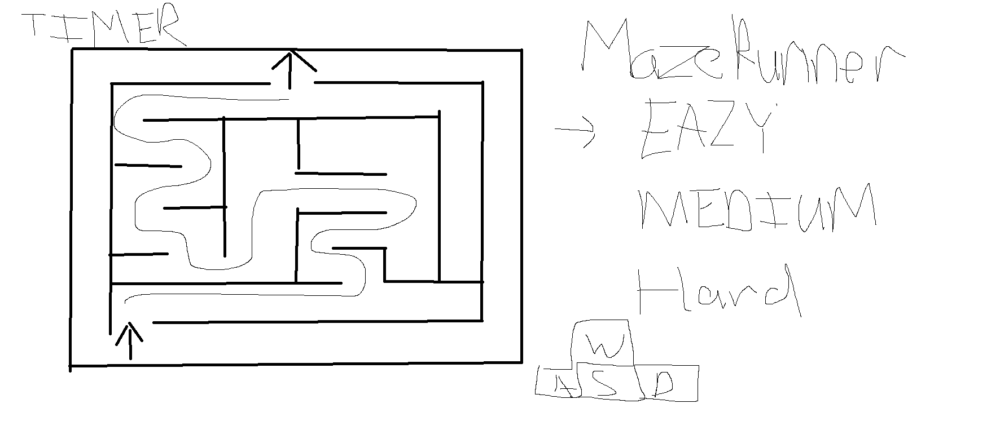
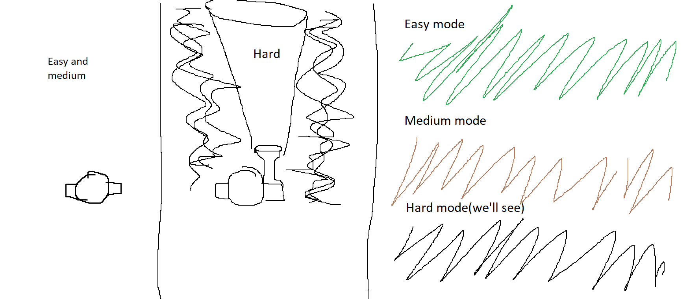

# game-project

## Intro
Maze runner is a game where you try to find your way out of the maze before the time is up.  You will have a choice in difficulty at the title screen

## User Stories
As a user, I want to:
- Choose the difficulty of my choosing
- Control the character using the WASD keys
- if music is play, add Volume control
- Move my character into a wall and not be able to pass through
- See a Winner/Fail Pop up alert if I hit set conditions with the ability to restart or exit game
- Be able to choose light/dark mode of background

## Technologies Used
- JavaScript
- CSS
- HTML
- Canvas

<!-- ## Game Project Idea

- Make the player exit the maze with in the time limit using 'w a s d' keys
- There will Multiple difficulties: Easy, Medium, Hard
- Easy: Clear as day, no timer
- Medium: Clear as day, 45 sec timer, 3 lifes
- Hard: Only has a flashlight to see x amount in front, 45 sec timer, 3 lifes

## functions
- player can't walk through walls
- user x,y needs to equal exit x,y to complete game
- when completed, reveal winner screen
- if player doesn't reach in x time, subtract one life
- if life = 0 show game over try again -->

